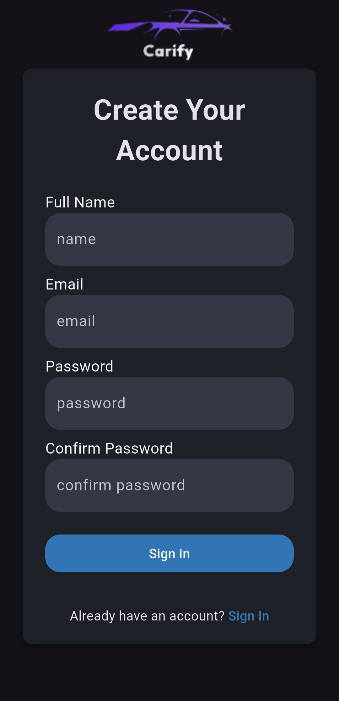
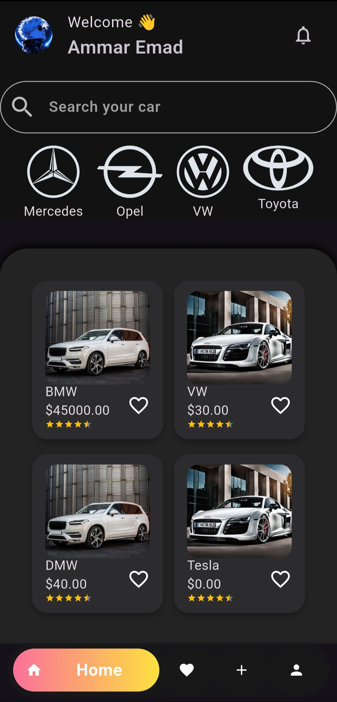

# 🚗 E-Commerce Cars App

A cross-platform Flutter e-commerce application for browsing and purchasing cars online.  
The app focuses on providing a smooth user experience with real-time data, cloud-based image hosting, and clean scalable architecture.

---

## ✨ Features

- User Authentication using Firebase Auth
- Browse cars with full details
- Add cars to cart and manage orders
- Role-based logic (User / Manager)
- Upload and display car images using Cloudinary
- State management using Cubit (Bloc)
- Clean Architecture implementation
- Responsive and modern UI

---

## 🛠 Tech Stack

| Category | Technologies |
|--------|--------------|
| 📱 Frontend | Flutter |
| 🧠 State Management | Cubit (Bloc) |
| ☁️ Backend | Firebase Authentication, Firestore |
| 🖼 Image Hosting | Cloudinary |
| 🧱 Architecture | Clean Architecture |

---

## 📸 Screenshots

  
  
  
    

  
  

🖼 Images are hosted and delivered using **Cloudinary** for better performance and scalability.

---
